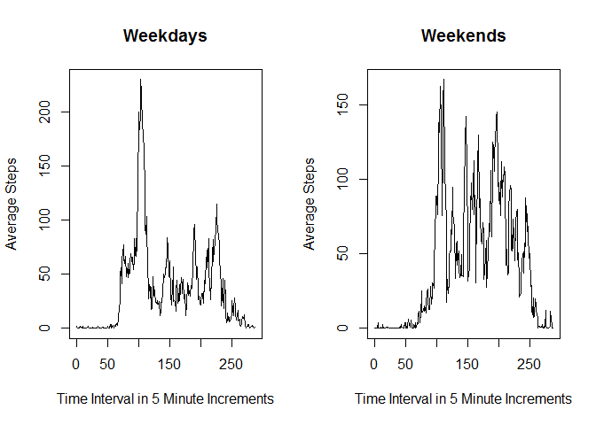

# Reproducible Research - Class Project 1

Read in the data file assuming it is in your working directory

```r
dat<- read.csv("activity.csv", stringsAsFactors = F)
```

Change the date variable to date class


```r
dat$date <-format(dat$date, format = "%d %m %Y")
dat$date <-as.Date(dat$date, format = "%Y-%m-%d")
```

Calculate total number of steps taken per day, ignoring missing values

```r
#x <- data.frame
as.matrix(tapply(dat$steps, dat$date, sum, na.rm=T))
```

```
##             [,1]
## 2012-10-01     0
## 2012-10-02   126
## 2012-10-03 11352
## 2012-10-04 12116
## 2012-10-05 13294
## 2012-10-06 15420
## 2012-10-07 11015
## 2012-10-08     0
## 2012-10-09 12811
## 2012-10-10  9900
## 2012-10-11 10304
## 2012-10-12 17382
## 2012-10-13 12426
## 2012-10-14 15098
## 2012-10-15 10139
## 2012-10-16 15084
## 2012-10-17 13452
## 2012-10-18 10056
## 2012-10-19 11829
## 2012-10-20 10395
## 2012-10-21  8821
## 2012-10-22 13460
## 2012-10-23  8918
## 2012-10-24  8355
## 2012-10-25  2492
## 2012-10-26  6778
## 2012-10-27 10119
## 2012-10-28 11458
## 2012-10-29  5018
## 2012-10-30  9819
## 2012-10-31 15414
## 2012-11-01     0
## 2012-11-02 10600
## 2012-11-03 10571
## 2012-11-04     0
## 2012-11-05 10439
## 2012-11-06  8334
## 2012-11-07 12883
## 2012-11-08  3219
## 2012-11-09     0
## 2012-11-10     0
## 2012-11-11 12608
## 2012-11-12 10765
## 2012-11-13  7336
## 2012-11-14     0
## 2012-11-15    41
## 2012-11-16  5441
## 2012-11-17 14339
## 2012-11-18 15110
## 2012-11-19  8841
## 2012-11-20  4472
## 2012-11-21 12787
## 2012-11-22 20427
## 2012-11-23 21194
## 2012-11-24 14478
## 2012-11-25 11834
## 2012-11-26 11162
## 2012-11-27 13646
## 2012-11-28 10183
## 2012-11-29  7047
## 2012-11-30     0
```


Create a histogram of the total number of steps taken per day

```r
hist(tapply(dat$steps, dat$date, sum), col="red", breaks=50, xlim=c(0, 25000),
     xlab="Total Steps Per Day", main="Frequency of Total Steps Per Day")
rug(tapply(dat$steps, dat$date, sum))
```

 

Calculate the mean total number of steps per day

```r
msd <- mean(tapply(dat$steps, dat$date, sum, na.rm = T))
```
The mean total steps per day is 9354.2295082.


Calculate the median total number of steps per day

```r
medsd <- median(tapply(dat$steps, dat$date, sum, na.rm=T))
```
The median total steps per day is 10395.


Create a time series plot of the 5 minute interval and the average number of steps taken in each interval

```r
plot(tapply(dat$steps, dat$interval, mean, na.rm=T), type="l", 
     xlab="Five Minute Time Intervals Across a Day", ylab = "Average Steps",
     main="Average Steps per Five Minute Time Interval")
```

 


Which 5 minute interval on average contains the most steps 

```r
max_int <- which.max(tapply(dat$steps, dat$interval, mean, na.rm=T))
```
The five minute interval which has the most steps on average is 104.


Calculate the total number of missing values in the data set

```r
miss <- sum(is.na(dat$steps))
```
The total number of missing values in the data set is 2304.


Fill in missing data with a mean for that particular interval across all days

```r
agg <- aggregate(dat$steps~dat$interval, FUN=mean, data=dat, na.action = "na.omit")
dat2 <- dat
dat2$steps[is.na(dat2$steps)] <- agg$`dat$steps`
```

Create a histogram of the total number of steps taken per day

```r
hist(tapply(dat2$steps, dat2$date, sum), col="red", breaks=50, 
     xlab="Total Steps Taken per Day", main="Frequency of Total Number of Steps  Taken per Day")
rug(tapply(dat2$steps, dat2$date, sum))
```

 

Calculate mean  total number of steps per day

```r
mean(tapply(dat2$steps, dat2$date, sum))
```

```
## [1] 10766.19
```

The mean number of steps per day with the missing values included was 9354.22.  Therefore, it appears that taking the average number of steps per day for the same time interval and including that in the calculations increased the average steps per day.

Calculate median total number of steps per day

```r
median(tapply(dat2$steps, dat2$date, sum))
```

```
## [1] 10766.19
```

The median number of steps per day with the missing values included was 10395. Therefore, it appears that taking the average number of steps per day for the same time interval and including that in the calculations increased the median steps per day.


Create a new factor variable for weekday and weekend

```r
dat2$dow <- as.factor(weekdays(dat2$date))
dat2$dow2 = as.factor(ifelse(dat2$dow=="Saturday" | dat2$dow=="Sunday","weekend","weekday"))
dat3 <- subset(dat2, dow2=='weekday')
dat4 <- subset(dat2, dow2=='weekend')
```


Create time series panel plot with weekend and weekday

```r
par(mfrow = c(1,2))
plot(tapply(dat3$steps, dat3$interval, mean), type="l",
     xlab = "Time Interval in 5 Minute Increments",
     ylab= "Average Steps", main = "Weekdays")
plot(tapply(dat4$steps, dat4$interval, mean), type="l",
     xlab = "Time Interval in 5 Minute Increments",
     ylab= "Average Steps", main = "Weekends")
```

 
